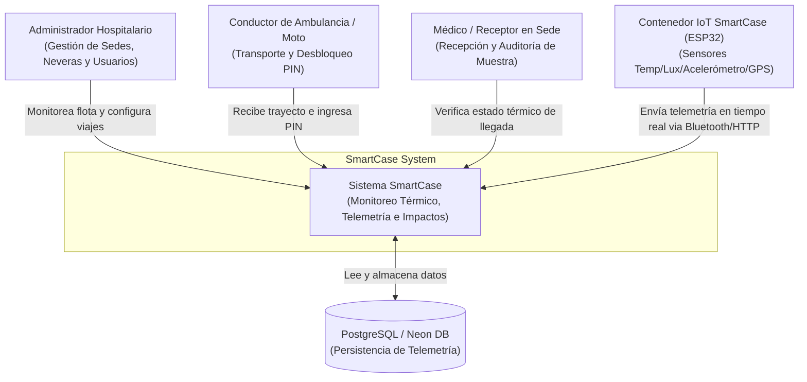
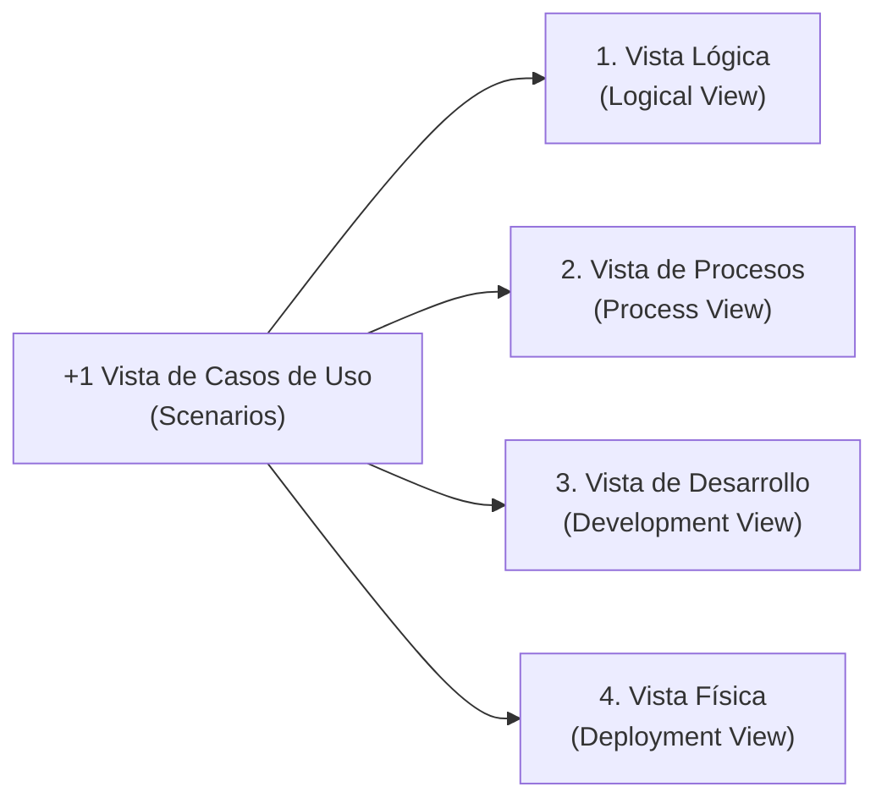

# SmartCase — Monitoreo IoT y Cadena de Custodia para Muestras Biológicas

[](https://go.dev/)
[](https://flutter.dev/)
[](https://www.docker.com/)
[](https://www.postgresql.org/)

**SmartCase** es un sistema integral basado en **Internet de las Cosas (IoT)**, backend distribuido en **Go** y aplicación cliente multiplataforma en **Flutter**, diseñado para garantizar la integridad térmica, detección de impactos físicos y control de acceso mediante geocercas en el transporte hospitalario de muestras biológicas críticas (sangre, sueros, tejidos u órganos).

El proyecto resuelve la problemática de "puntos ciegos" en la fase preanalítica de transporte intrahospitalario e intersede, reemplazando las neveras pasivas tradicionales por contenedores inteligentes con control activo de temperatura, monitoreo continuo de telemetría y cerradura solenoide automatizada.

---

## Vista General de la Interfaz

| Panel de Monitoreo General (Web) | Aplicación Móvil del Conductor |
| :---: | :---: |
|  |  |

### Panel Administrativo y Gestión de Trayectos


---

## Arquitectura del Sistema (Modelo C4)

Para documentar la arquitectura del sistema se empleó el estándar **C4 Model**, dividiéndolo en contexto, contenedores y componentes internos del servidor.

### Nivel 1: Diagrama de Contexto del Sistema (System Context)

El siguiente diagrama muestra cómo interactúan los usuarios finales, el hardware IoT y los sistemas externos con SmartCase:



---

### Nivel 2: Diagrama de Contenedores (Container Diagram)

Describe las tecnologías que conforman el stack tecnológico y sus canales de comunicación:

```mermaid
graph TB
    subgraph Hardware IoT Layer
        esp32[" ESP32 Microcontroller<br/>(Lectura Sensores + Solenoide + GPS)"]
    end

    subgraph Client Apps (Flutter)
        flutter_app[" Metro GPS Client App<br/>(Flutter Android / Web / Desktop)"]
    end

    subgraph Backend Layer (Go API)
        go_api[" Go REST API Server<br/>(Gin Framework / Router HTTP)"]
        ws_hub["⚡ WebSockets Hub<br/>(Transmisión Live Telemetría)"]
    end

    subgraph Storage Layer
        db[("PostgreSQL 16<br/>(Relacional + Extension pgcrypto)")]
    end

    esp32 -->|HTTP POST Telemetría / Bluetooth| go_api
    flutter_app -->|REST API / HTTP JSON| go_api
    flutter_app <-->|WebSocket Stream / JSON| ws_hub
    go_api -->|sqlx / pgx driver| db
    ws_hub -->|Consulta histórica| db
```

---

### Nivel 3: Diagrama de Componentes del Backend (Component Diagram)

Estructura interna en capas del servidor Go (`clean architecture`):

```mermaid
graph TD
    subgraph Router & Middlewares
        gin_router["Gin Engine Router"]
        auth_mid["Auth Middleware (JWT/RBAC)"]
    end

    subgraph Handlers Layer
        auth_h["AuthHandler"]
        viaje_h["ViajeHandler"]
        tele_h["TelemetriaHandler"]
        ws_h["WsHandler"]
    end

    subgraph Service Layer
        usuario_s["UsuarioService"]
        viaje_s["ViajeService"]
        smart_s["SmartService"]
    end

    subgraph Repository Layer
        usuario_r["UsuarioRepository"]
        viaje_r["ViajeCaseRepository"]
        tele_r["TelemetriaRepository"]
    end

    gin_router --> auth_mid
    auth_mid --> Handlers Layer
    viaje_h --> viaje_s
    auth_h --> usuario_s
    ws_h <--> ws_hub["WebSockets Hub"]
    viaje_s --> viaje_r
    tele_h --> tele_r
    usuario_s --> usuario_r
    Repository Layer --> DB[("PostgreSQL")]
```

---

## Modelo de Vistas 4+1

El modelo de vistas **4+1** describe el sistema desde cinco perspectivas complementarias para cubrir los requerimientos de arquitectura de software:



### 1. Vista Lógica (Logical View)
Define el modelo de dominio del sistema y las entidades relacionales:
- **Clínica & Sede**: Representan las instituciones médicas y sus sedes operativas (origen y destino).
- **Usuario**: Roles diferenciados en el sistema (`admin`, `coductor`, `receptor`).
- **SmartCase**: Entidad física del contenedor térmico con estado de solenoide (`bloqueado`, `desbloqueado`).
- **Ambulancia**: Vehículo asignado (`moto` o `ambulancia`).
- **Viaje**: Registro del transporte activo con trazabilidad, geovallas y PIN de seguridad de 6 dígitos.
- **Telemetría**: Trazas periódicas de temperatura interna, ambiente, humedad, lux (apertura imprevista de tapa), altitud, coordenadas GPS y fuerza G de impacto.

### 2. Vista de Procesos (Process View)
Describe la ejecución concurrente y el flujo de eventos:
- **Streaming de Telemetría**: El microcontrolador ESP32 (o la app móvil vía puente Bluetooth) envía paquetes JSON de telemetría al servidor. El servidor Go procesa el paquete y lo retransmite concurrentemente mediante Goroutines a todos los clientes suscritos al WebSocket del viaje.
- **Verificación de Geocerca y Desbloqueo por PIN**:
  1. El conductor llega a las coordenadas de la sede de destino.
  2. El sistema valida que la latitud y longitud actual se encuentren dentro del radio de geovalla permitido.
  3. El conductor ingresa el PIN de 6 dígitos enviado previamente al receptor.
  4. Si las coordenadas y el PIN coinciden, la API retorna la señal de apertura a la cerradura solenoide.

### 3. Vista de Desarrollo (Development View)
Organización modular del código fuente:

```text
SmartCase/
├── backend/                  # Servidor en Go (REST + WebSockets)
│   ├── cmd/api/main.go       # Punto de entrada principal
│   ├── config/               # Carga de variables de entorno (.env / Neon Cloud)
│   ├── internal/             # Lógica de dominio privada
│   │   ├── handlers/         # Controladores HTTP / WS
│   │   ├── models/           # Structs de base de datos y JSON
│   │   ├── repository/       # Consultas SQL con sqlx / pgx
│   │   ├── server/routes/    # Definición de rutas e inyección de dependencias
│   │   ├── service/          # Reglas de negocio e intermediación
│   │   └── websockets/       # Hub centralizado de canales WebSocket
│   ├── pkg/database/         # Conexión al pool de PostgreSQL
│   └── Dockerfile            # Construcción multi-etapa Go
├── metro_gps/                # Cliente en Flutter (Web & Móvil)
│   ├── lib/                  # Módulos Dart (auth, admin, conductor, receptor)
│   ├── web/                  # Plantilla e index para despliegue Web SPA
│   ├── nginx.conf            # Configuración Nginx para Docker Web
│   └── Dockerfile            # Construcción multi-etapa Flutter Web + Nginx
├── ESP32/                    # Firmware para Hardware IoT
│   ├── datos.c++             # Código C++ para lectura de sensores e impacto
│   └── bd.sql                # Script de creación de tablas PostgreSQL
└── docker-compose.yml        # Orquestación local completa
```

### 4. Vista Física / Despliegue (Physical View)
Topología de infraestructura de producción y desarrollo:
- **Nodo IoT (Hardware)**: Microcontrolador ESP32 + Módulo de Enfriamiento Peltier + Sensores (DS18B20, MPU6050, NEO-6M GPS) alimentado por batería LiFePO4 de 12V.
- **Servidor de Aplicaciones**: Contenedor Docker ejecutando el ejecutable compilado en Go sobre una imagen ligera Alpine Linux.
- **Servidor Web**: Contenedor Nginx sirviendo la aplicación web SPA de Flutter en puerto 3000 (o despliegue nativo APK para dispositivos Android).
- **Servidor de Base de Datos**: PostgreSQL 16 con extensión `pgcrypto` para generación de UUIDs nativos.

### +1 Vista de Casos de Uso / Escenarios (Use Case Scenarios)
1. **Creación y Asignación de Viaje**: Un usuario `admin` configura un nuevo trayecto especificando la nevera `SmartCase`, el conductor, el vehículo, la sede de origen y destino, generando un PIN único de 6 dígitos.
2. **Monitoreo en Tránsito**: La nevera transmite telemetría continuamente. Si la temperatura excede los 8°C o la fuerza G sobrepasa los 2.0g, se genera una alerta inmediata en el panel del receptor y administrador.
3. **Recepción de Muestra y Cadena de Custodia**: Al llegar a la sede destino, el receptor valida la temperatura promedio registrada durante el viaje y autoriza el ingreso del PIN para la apertura física de la nevera.

---

## Componentes del Hardware IoT (ESP32)

| Componente | Función | Especificación / Modelo |
| :--- | :--- | :--- |
| **Microcontrolador** | Procesamiento central y conectividad | ESP32 WROOM-32U |
| **Sensor de Temperatura** | Medición interna en cámara biológica | DS18B20 / DHT22 (Precisión ±0.5°C) |
| **Acelerómetro / Giroscopio** | Detección de golpes, caídas y vibraciones (Fuerza G) | MPU-6050 (Ejes X, Y, Z) |
| **Módulo GPS** | Posicionamiento satelital y geovallado | NEO-6M GPS |
| **Sensor de Luz (Lux)** | Detección de apertura no autorizada de tapa | Fotorresistencia LDR / BH1750 |
| **Actuador Térmico** | Sistema de enfriamiento termoeléctrico activo | Celda Peltier TEC1-12706 + Disipador |
| **Cerradura de Seguridad** | Bloqueo físico de la nevera por geocerca | Solenoide electromagnético de 12V |

---

## Esquema de Base de Datos (PostgreSQL)

El sistema utiliza las siguientes tablas relacionales (disponibles en `ESP32/bd.sql`):

```sql
-- Extensión requerida
CREATE EXTENSION IF NOT EXISTS "pgcrypto";

-- Tablas Principales
1. clinica      (id_clinica UUID, nombre VARCHAR)
2. sede         (id_sede UUID, id_clinica UUID, nombre VARCHAR)
3. usuario      (id_usuario UUID, id_sede UUID, nombre_completo, rol ['coductor','receptor','admin'], email, password)
4. smartcase    (id_caja UUID, estado_solenoide ['bloqueado','desbloqueado'], organo VARCHAR)
5. ambulancia   (id_ambulancia UUID, placa VARCHAR, tipo ['moto','ambulancia'])
6. viaje        (id_viaje UUID, id_caja, id_usuario_conductor, id_usuario_receptor, id_sede_origen, id_sede_destino, id_ambulancia, fecha_inicio, fecha_llegada, estado_viaje, pin_entrega)
7. telemetria   (id_telemetria UUID, id_viaje UUID, temperatura_interna, temperatura_ambiente, humedad, lux, altitud, latitud_actual, longitud_actual, fuerza_g_impacto, alerta_generada, registrado_en)
```

---

## 🐳 Despliegue Rápido con Docker Compose

El proyecto incluye una configuración lista para producción o pruebas locales con **Docker Compose**.

### Requisitos Previos
- Docker Engine v24.0+
- Docker Compose v2.20+

### Pasos para Ejecutar el Stack Completo

1. **Clonar el repositorio**:
   ```bash
   git clone https://github.com/HashMap-silver-00011000/SmartCase.git
   cd SmartCase
   ```

2. **Iniciar los servicios con Docker Compose**:
   ```bash
   docker compose up --build -d
   ```

3. **Verificar el estado de los contenedores**:
   ```bash
   docker compose ps
   ```

4. **Acceso a las aplicaciones**:
   - **Frontend Web (Flutter)**: [http://localhost:3000](http://localhost:3000)
   - **Backend API (Go)**: [http://localhost:8080/api](http://localhost:8080/api)
   - **Base de Datos PostgreSQL**: `localhost:5432` (Usuario: `postgres`, Password: `smartcase_password`, BD: `smartcase_db`)

5. **Detener el entorno**:
   ```bash
   docker compose down -v
   ```

---

## Ejecución Manual en Entornos de Desarrollo

### Backend (Go)

```bash
cd backend

# Crear archivo de configuración .env basado en la plantilla
cat <<EOF > .env
DB_Host=localhost
DB_Port=5432
DB_User=postgres
DB_Password=smartcase_password
DB_Name=smartcase_db
PORT=8080
EOF

# Descargar dependencias y ejecutar
go mod tidy
go run ./cmd/api
```

### Frontend (`metro_gps` / Flutter)

```bash
cd metro_gps

# Obtener paquetes de Flutter
flutter pub get

# Ejecutar en navegador Web
flutter run -d chrome --dart-define=API_BASE_URL=http://localhost:8080

# En caso de ejecutar en dispositivo Android físico conectando al servidor local
adb reverse tcp:8080 tcp:8080
flutter run -d android --dart-define=API_BASE_URL=http://localhost:8080
```

---

## 🛰️ Referencia de Endpoints API

### Autenticación Pública
- `POST /api/login`: Inicio de sesión y generación de token de sesión/JWT.
- `POST /api/register`: Registro de nuevos usuarios.

### Panel de Administración (`/api/app/panel-admin`) — *Requiere Rol `admin`*
- `POST /api/app/panel-admin/clinica/crear`: Registrar nueva clínica.
- `GET /api/app/panel-admin/clinica/lista`: Listar clínicas registradas.
- `POST /api/app/panel-admin/clinica/sede/crear`: Crear sede asociada a una clínica.
- `POST /api/app/panel-admin/smartcase/crear`: Registrar nuevo contenedor SmartCase.
- `POST /api/app/panel-admin/ambulancia/crear`: Registrar vehículo de transporte.
- `POST /api/app/panel-admin/viaje/crear`: Iniciar nuevo viaje de transporte biológico.
- `GET /api/app/panel-admin/viaje/tareas-viaje-telemetria`: Endpoint WebSocket para monitoreo en vivo.

### Zona Conductor (`/api/app/conductor`) — *Requiere Rol `coductor`*
- `GET /api/app/conductor/viaje/tareas-viaje`: Obtener viajes asignados al conductor.
- `PUT /api/app/conductor/viaje/actualizar-estado-viaje`: Cambiar estado (`transito`, `entregado`, `muestra comprometida`).
- `POST /api/app/conductor/viaje/pin-desbloqueo`: Validar PIN de 6 dígitos para abrir la solenoide.

### Zona Receptor (`/api/app/medico`) — *Requiere Rol `receptor`*
- `GET /api/app/medico/viaje/tareas-viaje`: Listar paquetes biológicos programados para recepción.
- `GET /api/app/medico/viaje/telemetria`: Consultar histórico térmico e impactos del viaje.

---

## Cómo Contribuir

¡Las contribuciones son bien recibidas! Revisa nuestro archivo [CONTRIBUTING.md](CONTRIBUTING.md) para conocer las pautas de estilo de código, flujos de ramas en Git y normas para el envío de Pull Requests.

---

## Licencia

Este proyecto está licenciado bajo los términos de la licencia MIT. Consulta el archivo `LICENSE` para más información.
