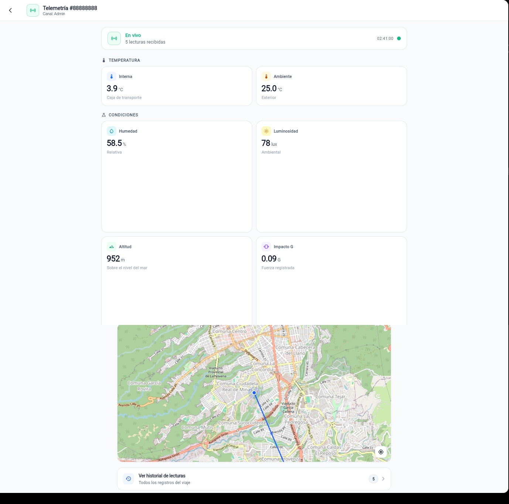
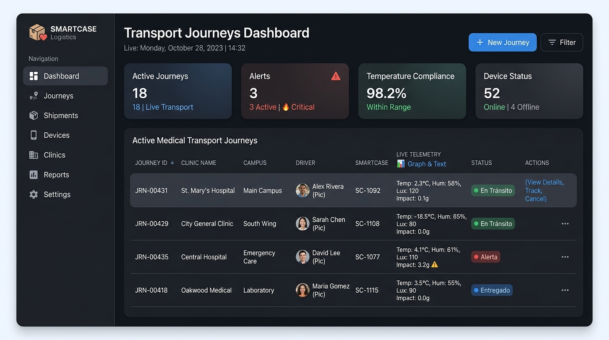
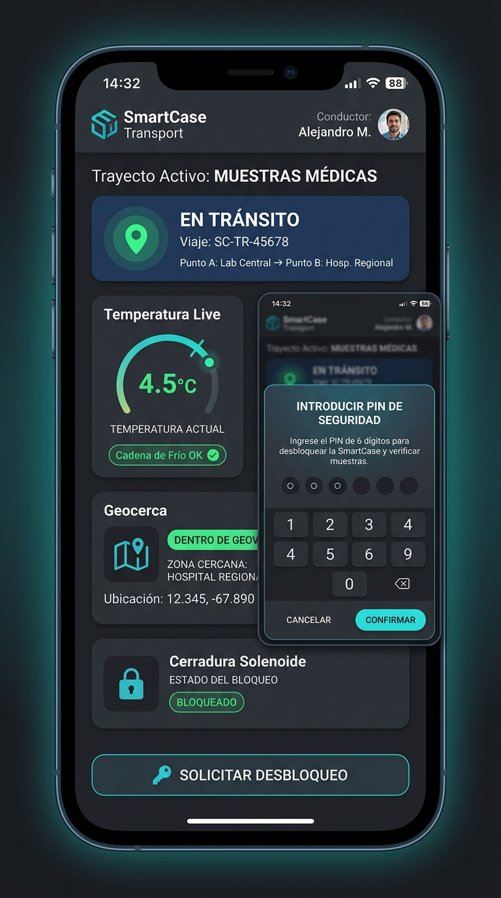
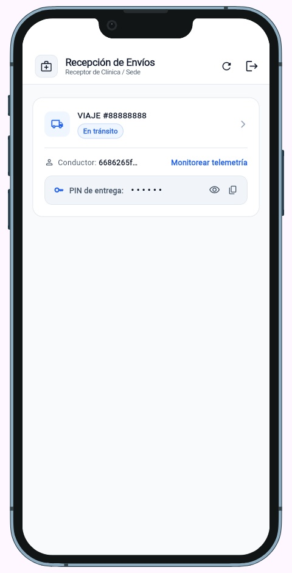
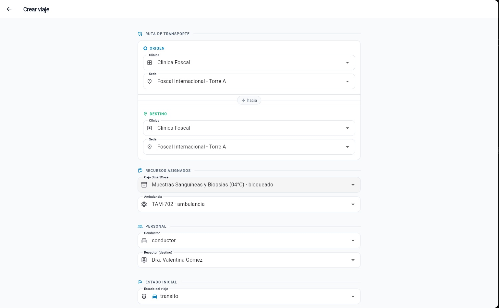

# SmartCase — Monitoreo IoT y Cadena de Custodia para Muestras Biológicas

[](https://go.dev/)
[](https://flutter.dev/)
[](https://www.docker.com/)
[](https://www.postgresql.org/)

**SmartCase** es un sistema integral basado en **Internet de las Cosas (IoT)**, backend distribuido en **Go** y aplicación cliente multiplataforma en **Flutter**, diseñado para garantizar la integridad térmica, la detección de impactos físicos y el control de acceso mediante geocercas en el transporte hospitalario de muestras biológicas críticas (sangre, sueros, tejidos u órganos).

El proyecto resuelve la problemática de "puntos ciegos" en la fase preanalítica de transporte intrahospitalario e intersede, reemplazando las neveras pasivas tradicionales por contenedores inteligentes con control activo de temperatura, monitoreo continuo de telemetría y cerradura solenoide automatizada.

---

## Vista General de la Interfaz

La plataforma cuenta con interfaces reactivas y adaptadas para cada perfil operacional del sistema:

### 1. Panel de Monitoreo General y Telemetría en Vivo (Web SPA)
Supervisión centralizada en tiempo real de la cadena de frío (temperatura interna y exterior), condiciones ambientales (humedad, luminosidad, altitud, acelerometría de impacto) y trazado GPS sobre OpenStreetMap.

| Telemetría IoT en Vivo y Rastreo GPS | Panel Administrativo de Recursos |
| :---: | :---: |
|  |  |

### 2. Aplicaciones Móviles Operativas (Conductor y Médico Receptor)
Clientes con soporte responsivo para la custodia física del contenedor inteligente, trazado en ruta y desbloqueo seguro de la cerradura electromagnética mediante código PIN:

| App Móvil del Conductor (En Tránsito y Validación de PIN) | App Móvil del Médico Receptor (Custodia y Recepción) |
| :---: | :---: |
|  |  |

### 3. Asignación y Despacho de Nuevos Viajes
Módulo administrativo para la creación y despacho de traslados, vinculando la caja SmartCase, vehículo de transporte, clínica/sede origen y destino, conductor y médico receptor:



---

## Demostración en Video del Proyecto

A continuación se presentan las grabaciones en video del ecosistema **SmartCase** en operación real (adquisición de telemetría con sensores ESP32, control activo y sincronización con la aplicación multiplataforma):

| Video 1: Hardware IoT y Sensores en Tiempo Real | Video 2: Flujo Operativo y Plataforma de Software |
| :---: | :---: |
| [](https://www.youtube.com/watch?v=ID_VIDEO_1)<br><sub>*(Clic para reproducir en YouTube)*</sub> | [](https://www.youtube.com/watch?v=ID_VIDEO_2)<br><sub>*(Clic para reproducir en YouTube)*</sub> |

> [!TIP]
> Para vincular tus videos, reemplaza `ID_VIDEO_1` e `ID_VIDEO_2` por los IDs correspondientes de tus videos subidos en YouTube.

---

## Inicio Rápido en 1 Comando

Puedes levantar todo el ecosistema (**PostgreSQL + API Go + Frontend Web Nginx**) ejecutando:

```bash
docker compose up --build -d
```

Una vez iniciados los contenedores:
- **Frontend Web**: [http://localhost:3000](http://localhost:3000)
- **Backend REST API**: [http://localhost:8080/api](http://localhost:8080/api)
- **Base de Datos PostgreSQL**: `localhost:5432`

---

## Índice de Documentación Técnica

Para evitar un documento demasiado extenso, la información detallada del proyecto se encuentra organizada en los siguientes módulos:

| Documento | Descripción |
| :--- | :--- |
| **[Arquitectura y Modelo C4](docs/ARCHITECTURE.md)** | Diagramas C4 (Contexto, Contenedores, Componentes) y Modelo de Vistas 4+1 |
| **[Hardware IoT y Base de Datos](docs/HARDWARE_DATABASE.md)** | Componentes electrónicos ESP32, sensores (DS18B20, MPU6050, GPS) y esquema SQL |
| **[Referencia de API REST y WebSockets](docs/API_REFERENCE.md)** | Endpoints HTTP de autenticación, zonas admin, conductor, médico y canal WebSocket |
| **[Guía de Docker y Despliegue](docs/DOCKER_GUIDE.md)** | Explicación de Dockerfiles multi-etapa y administración de contenedores |
| **[Guía de Contribución](CONTRIBUTING.md)** | Flujo de trabajo en Git, estándares de código y convenciones de commits |

---

## Resumen de Arquitectura

- **Hardware Node (ESP32)**: Adquiere métricas de sensores (temperatura, acelerometría de golpe, posicionamiento GPS, luz) y controla el enfriamiento Peltier y el solenoide electromagnético.
- **Backend API (Go)**: Diseñado en capas (*Clean Architecture*) con `Gin Framework`, `sqlx` y un servidor de `WebSockets` para transmisión concurrente de telemetría.
- **Frontend App (Flutter)**: Cliente multiplataforma (Android y Web SPA) con paneles adaptados a los roles de Administrador, Conductor y Médico Receptor.
- **Storage (PostgreSQL 16)**: Persistencia relacional optimizada con claves UUID v4 nativas.

---

## Licencia

Este proyecto está licenciado bajo los términos de la licencia **MIT**. Consulta el archivo `LICENSE` para más información.
