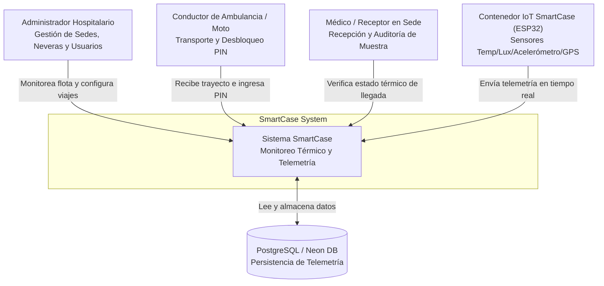
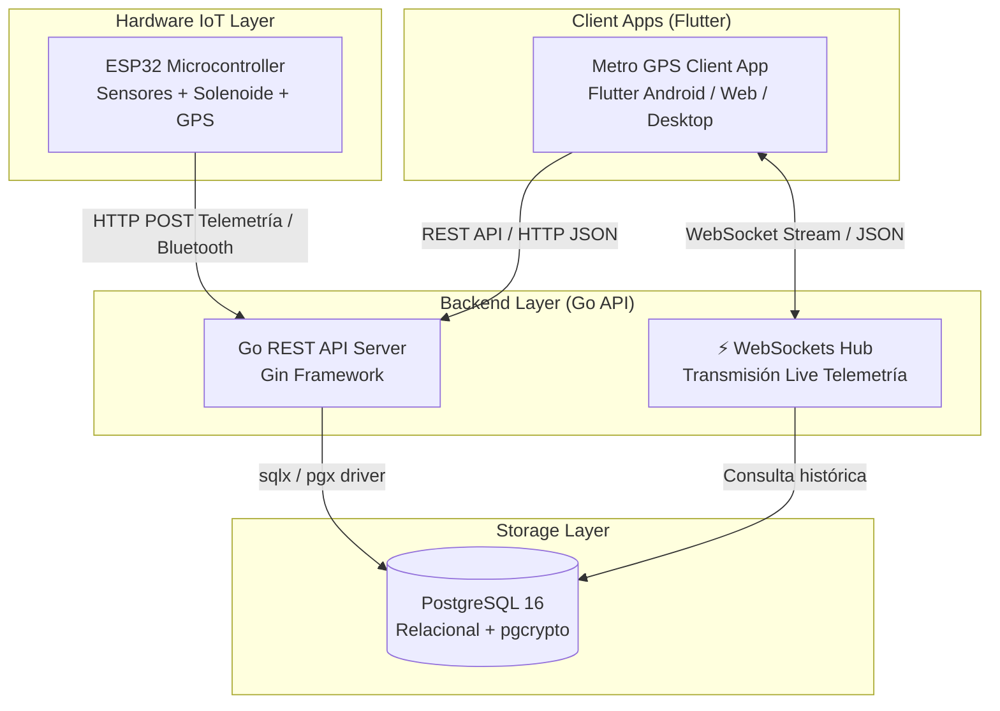
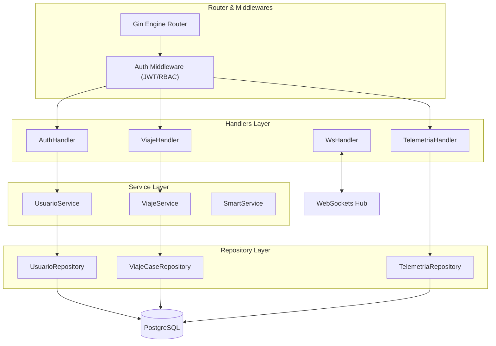
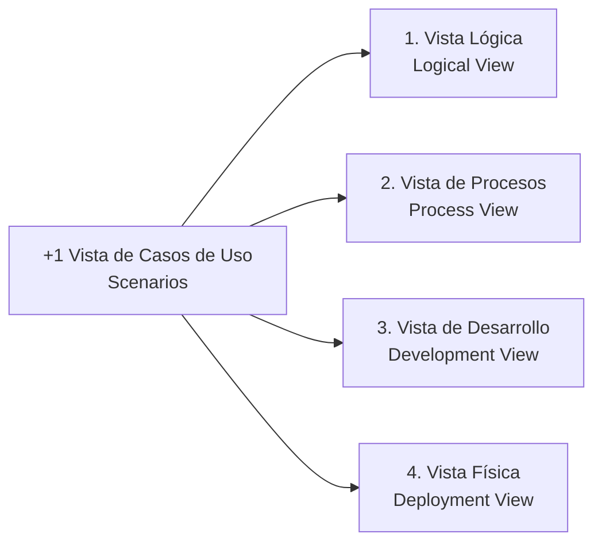

# Arquitectura de Software — SmartCase

Este documento describe la arquitectura detallada de **SmartCase** utilizando el estándar **Modelo C4** y el **Modelo de Vistas 4+1**.

---

## Modelo C4

El Modelo C4 permite abstraer y visualizar la arquitectura del sistema en diferentes niveles de profundidad.

### Nivel 1: Diagrama de Contexto del Sistema (System Context)

Muestra los actores que interactúan con el sistema y los límites del dominio:

---

### Nivel 2: Diagrama de Contenedores (Container Diagram)

Identifica las aplicaciones ejecutables y los almacenes de datos:

---

### Nivel 3: Diagrama de Componentes del Backend (Component Diagram)

Muestra la descomposición interna del servidor Go en paquetes desacoplados (*Clean Architecture*):

---

## Modelo de Vistas 4+1

El modelo 4+1 complementa la vista estática con aspectos dinámicos, físicos y de desarrollo.

### 1. Vista Lógica (Logical View)
Define el modelo de dominio e interconexiones de datos:
- **Clínica & Sede**: Entidades institucionales que agrupan sedes de origen y destino.
- **Usuario**: Roles con permisos restringidos (`admin`, `coductor`, `receptor`).
- **SmartCase**: Entidad física del contenedor térmico y estado de solenoide (`bloqueado`, `desbloqueado`).
- **Ambulancia**: Vehículo logístico asociado al trayecto (`moto` o `ambulancia`).
- **Viaje**: Objeto raíz de la sesión logística con trazabilidad, geovalla y PIN de seguridad.
- **Telemetría**: Puntos periódicos de lectura ambiental, física y geográfica.

### 2. Vista de Procesos (Process View)
Representa los flujos de ejecución concurrentes:
- **Transmisión de Telemetría**: El dispositivo ESP32 o el puente móvil emiten un payload JSON periódicamente. El servidor Go procesa el registro en base de datos y difunde concurrentemente a través del `WebSockets Hub` a todas las pantallas cliente conectadas.
- **Validación de Geocerca y Desbloqueo por PIN**:
  1. El conductor arriba a la sede receptora.
  2. La aplicación verifica si las coordenadas GPS actuales se encuentran dentro del radio de tolerancia de la sede destino.
  3. Al ingresar el PIN de 6 dígitos suministrado al receptor, el backend valida la correspondencia y emite la instrucción de desenganche del solenoide.

### 3. Vista de Desarrollo (Development View)
Organización del proyecto en módulos y paquetes:
- **`backend/`**: Proyecto escrito en Go estructurado en `cmd/api`, `internal/` (`handlers`, `models`, `repository`, `service`, `websockets`) y `pkg/database`.
- **`metro_gps/`**: Proyecto Flutter estructurado en módulos funcionales (`auth`, `admin`, `conductor`, `receptor`, `core`).
- **`ESP32/`**: Código C++ para la programación de firmware en microcontroladores.

### 4. Vista Física / Despliegue (Physical View)
- **Nodo IoT**: ESP32 WROOM-32U con sensores (DS18B20, MPU6050, NEO-6M), celda Peltier y actuador electromagnético.
- **Servidor API**: Contenedor Docker ligero (*Alpine Linux*) ejecutando el ejecutable compilado en Go.
- **Servidor Frontend**: Contenedor Nginx sirviendo la aplicación SPA Flutter Web en puerto `3000`.
- **Base de Datos**: PostgreSQL 16 con extensión `pgcrypto` para generación de claves UUID v4.

### +1 Vista de Escenarios / Casos de Uso
1. **Inicio de Transporte Biológico**: Creación del viaje desde el panel administrativo asignando conductor, sede origen, sede destino y SmartCase.
2. **Alertas en Tiempo Real**: Notificación inmediata si la temperatura excede los 8°C o se detecta un choque superior a 2.0g.
3. **Entrega y Cadena de Custodia**: Verificación de historial térmico por parte del médico receptor e ingreso de PIN para recepción física.
